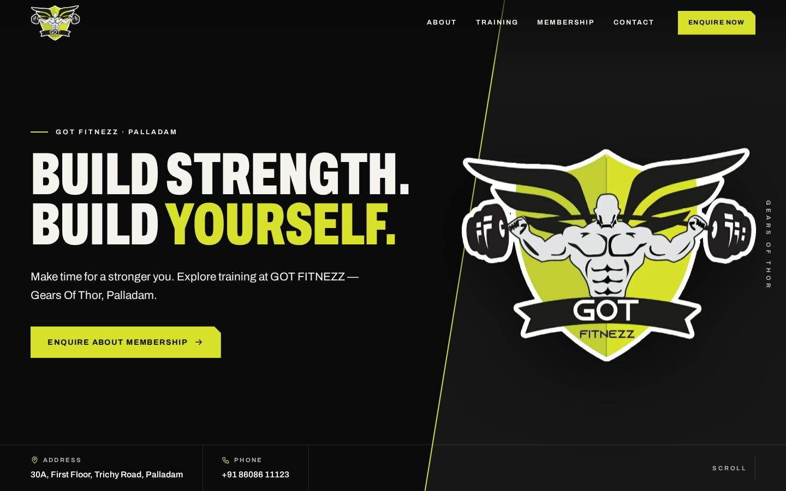

# GOT FITNEZZ — Gears Of Thor

Website and owner dashboard for **GOT FITNEZZ**, a gym in Palladam, Tamil Nadu.



## What’s included

**The website** is a one-page design: a dark background, oversized condensed headlines, the original GOT FITNEZZ logo and its lime accent.

- Hero, brand statement, pausable text strip, training panels, gym gallery with a photo viewer, membership enquiry, visit and contact, FAQ and footer.
- Optional coaches, member reviews and transformation stories. They stay hidden until real content is added, and reviews and stories need the member’s permission or consent.
- A “Request a Callback” form. It shows success only after the enquiry is saved, keeps everything typed if sending fails, and works without JavaScript.
- Spam protection: a hidden trap field, a signed timing token, a limit on repeated sends and link filtering. Cloudflare Turnstile can be added.
- Restrained motion that respects “reduce motion” settings and stays readable if scripts fail. Phones get a sticky Call / Enquire bar.
- Local business structured data (`ExerciseGym`) built only from confirmed details, plus a sitemap, robots.txt and social sharing tags.

**The dashboard** at `/admin` lets the owner, with no coding:

- Edit every piece of website text, reorder or hide sections, and change colours, the logo and SEO details.
- Upload photos and a hero video. Photos are resized to WebP automatically and camera GPS data is removed.
- Manage training options, membership plans, coaches, reviews, stories, facilities and FAQs.
- Preview drafts on desktop, tablet and phone before publishing. Publish history allows restoring earlier versions.
- Work through enquiries (New / Contacted / Follow-up / Joined), add notes and export to CSV.
- Give staff their own logins with limited roles (Owner, Editor, Staff).
- Follow a built-in owner checklist and how-to guide.

## Documents

| For | Read |
| --- | --- |
| Owner (everyday use) | [docs/OWNER-GUIDE.md](docs/OWNER-GUIDE.md), also inside the dashboard under **How-to guide** |
| Information still to confirm | [docs/OWNER-CHECKLIST.md](docs/OWNER-CHECKLIST.md), with a live version in the dashboard |
| Putting it on Hostinger | [docs/DEPLOY-HOSTINGER.md](docs/DEPLOY-HOSTINGER.md) |

## Technology

Plain PHP 8.1+ with MySQL/MariaDB, plus SQLite for local development. There is no framework, no Composer packages and no build step, so it runs on every Hostinger web and cloud hosting plan. The front end is hand-written CSS and vanilla JavaScript, and the Archivo font is self-hosted.

```
.htaccess        sends all requests into public/ on shared hosting
public/          web root: index.php, assets (CSS, JS, fonts, images), uploads/
app/             application code (lib/), page templates (views/), database migrations, seed content and logo
storage/         private: config.php (written by the installer), database (SQLite), logs, sessions
docs/            owner guide, deployment guide, checklist, original logo
tests/           unit tests and end-to-end browser tests
bin/             command-line installer and ZIP builder
```

## Running it locally

```bash
php bin/install.php --db=sqlite --email=you@example.com --password="a long password"
php -S 127.0.0.1:8000 -t public public/index.php
# website: http://127.0.0.1:8000   dashboard: http://127.0.0.1:8000/admin
```

## Tests

```bash
php tests/unit.php          # core rules: validation, hours, tokens, sanitising, defaults
bash tests/e2e/run.sh       # browser tests on a throw-away install (needs Node.js + Playwright)
DB=mysql DB_NAME=gym DB_USER=gym DB_PASS=secret bash tests/e2e/run.sh   # same against MySQL
```

The browser tests cover the enquiry form (success, validation, network failure and retry, no-JavaScript fallback, spam filters, rate limiting), dashboard sign-in and roles, enquiry statuses and CSV export, draft → preview → publish, photo uploads and the gallery, section ordering, publish history, phone layout and reduced motion. They also check for horizontal overflow at six screen sizes.

## Licences

The Archivo font is used under the SIL Open Font License (see `public/assets/fonts/OFL.txt`). The GOT FITNEZZ name and logo belong to GOT FITNEZZ.
