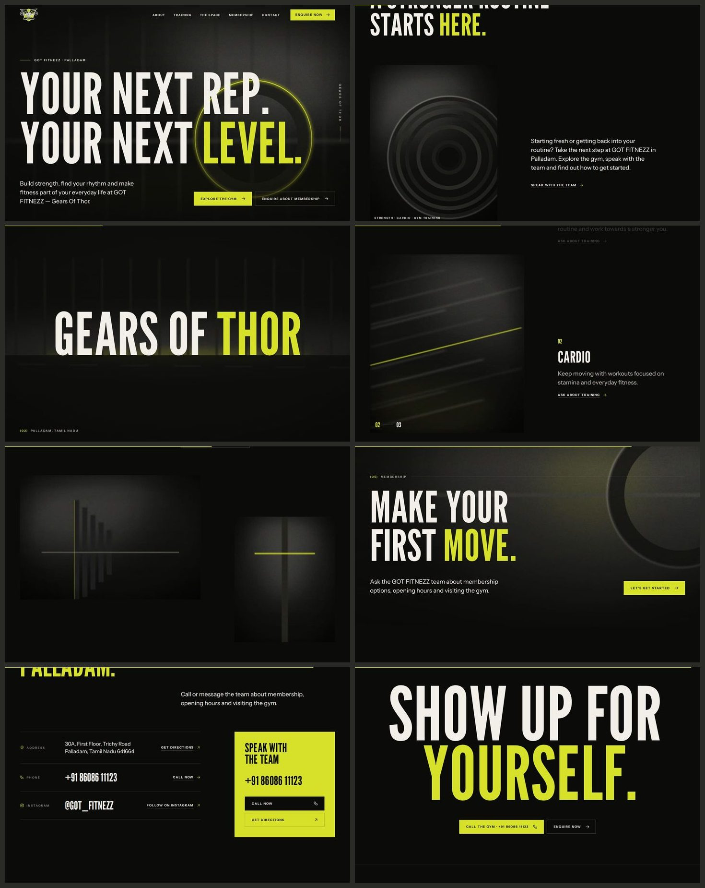
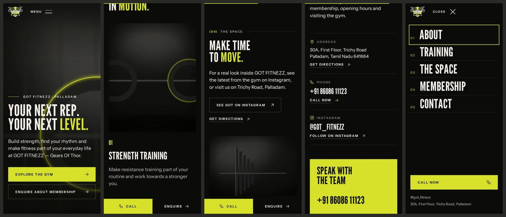

# GOT FITNEZZ — Gears Of Thor

Website for GOT FITNEZZ, a gym on Trichy Road, Palladam, Tamil Nadu.





Photo slots currently hold designed placeholders until the owner's photos are added.

A cinematic one-page site with custom motion, built with Astro as a static
site. Hosted on Netlify (Vercel-compatible). There is no CMS: changes are made
by asking Claude, which edits this repository, shares a preview link and
publishes after approval.

- **Maintainers (and Claude):** start with [CLAUDE.md](CLAUDE.md).
- **Hosting, costs, previews, publishing, rollback:** [docs/HOSTING.md](docs/HOSTING.md)
- **Photos and video slots:** [docs/IMAGES.md](docs/IMAGES.md)
- **Details awaiting the owner's confirmation:** [docs/OWNER-CHECKLIST.md](docs/OWNER-CHECKLIST.md)
- **Change history:** [CHANGELOG.md](CHANGELOG.md)

```
npm install
npm run dev      # http://localhost:4321
npm run build    # output in dist/
npm run qa       # screenshots and checks (after build)
```

The previous PHP version with its owner dashboard is kept in
[`hostinger-php/`](hostinger-php/README.md). It is not part of the Netlify site.
